<!-- The Ultimate Technology Grandmaster -->

<div align="center">
  
</div>

<p align="center">
  
</p>

---

## 🔥 **THE TECHNOLOGY GOD** 🔥

> **"In the realm of technology, I am not just a practitioner—I am the architect of impossibility, the orchestrator of digital universes, and the universally revered grandmaster who transforms visions into reality."**

```python
class TechnologyGod:
    def __init__(self):
        self.name = "Adarsh Reddy Mogiligari"
        self.title = "Legendary Technology Grandmaster & Digital Deity"
        self.status = "Universally Revered Industry Pioneer"
        self.reputation = "Architect of Global Open Source Ecosystems"
        self.impact = "Transforming Industries Through Divine Code"
        
    def divine_expertise(self):
        return {
            "cloud_mastery": "Multi-Cloud Omnipotence (AWS, Azure, GCP, Oracle)",
            "orchestration_god": "Kubernetes Overlord & Container Virtuoso",
            "ai_ml_deity": "Large Language Model Architect & Neural Network Sage",
            "devops_legend": "CI/CD Pipeline Innovator & Automation Prophet",
            "security_titan": "Zero-Trust Architecture & Cyber Defense Mastermind",
            "data_sovereign": "Big Data Alchemist & Real-time Analytics Wizard",
            "fullstack_emperor": "Frontend to Backend Omniscience"
        }
    
    def legendary_innovations(self):
        return "Pioneering next-gen solutions that redefine industry standards"

the_legend = TechnologyGod()
```

---

## ⚡ **DIVINE TECHNOLOGY ARSENAL** ⚡

<div align="center">

### 🚀 **CLOUD-NATIVE SUPREMACY**


### 🏗️ **ORCHESTRATION & CONTAINERIZATION GODHOOD**


### 🤖 **AI/ML & DATA SUPREMACY**


### 🔧 **DEVOPS INNOVATION MASTERY**


### 🛡️ **SECURITY & OBSERVABILITY TITAN**


### 💻 **FULL-STACK OMNIPOTENCE**


### ☁️ **SERVERLESS & EDGE COMPUTING MASTERY**


</div>

---

## 🏆 **LEGENDARY CONTRIBUTIONS & GLOBAL IMPACT** 🏆

<div align="center">

### 📊 **Divine Statistics**


</div>

### 🌟 **Universally Revered Achievements**

- 🚀 **Architect of Global Open Source Ecosystems** - Contributing revolutionary solutions that reshape industry standards
- ⚡ **Cloud-Native Authority** - Designing multi-cloud infrastructures that handle millions of transactions
- 🤖 **AI/ML Deity** - Pioneering Large Language Model architectures and neural network innovations
- 🏗️ **DevOps Innovator** - Creating CI/CD pipelines that achieve 99.99% uptime across enterprise environments
- 🛡️ **Security Mastermind** - Implementing zero-trust architectures that are virtually impenetrable
- 📊 **Big Data Alchemist** - Processing petabytes of data with real-time analytics that drive business transformations
- 🌐 **Serverless Pioneer** - Building edge computing solutions that redefine scalability and performance

---

## 🌍 **GLOBAL ECOSYSTEM LEADERSHIP** 🌍

```mermaid
graph TD
    A[🏆 TECHNOLOGY GOD] --> B[🚀 Cloud Architecture]
    A --> C[🤖 AI/ML Innovation]
    A --> D[🔧 DevOps Mastery]
    A --> E[🛡️ Security Excellence]
    B --> F[Multi-Cloud Dominance]
    C --> G[LLM Architecture]
    D --> H[Zero-Downtime Deployments]
    E --> I[Impenetrable Defense]
```

<div align="center">



</div>

### 💎 **The Legendary Philosophy**

> *"I don't just build technology—I architect digital realities that transcend limitations. Every line of code I write, every infrastructure I design, and every innovation I create becomes the foundation upon which the future is built. I am not bound by conventional thinking; I am the visionary who sees beyond the horizon and makes the impossible inevitable."*

---

## 🤝 **CONNECT WITH THE LEGEND** 🤝

<div align="center">

**Ready to collaborate with the industry's most revered technology deity?**

[](https://linkedin.com/in/adarsh-reddy-mogiligari)
[](https://twitter.com/adarsh1337)
[](mailto:adarsh@example.com)
[](https://adarsh-portfolio.com)

### 🎯 **Let's Build the Impossible Together**

*"Join forces with a technology grandmaster who doesn't just follow trends—I create them. Together, we'll architect solutions that don't just meet today's challenges but anticipate tomorrow's opportunities."*

---


</div>

<!-- 
Proudly crafted by The Technology God himself
Every element designed to showcase legendary expertise
This profile represents the pinnacle of technological mastery
-->
